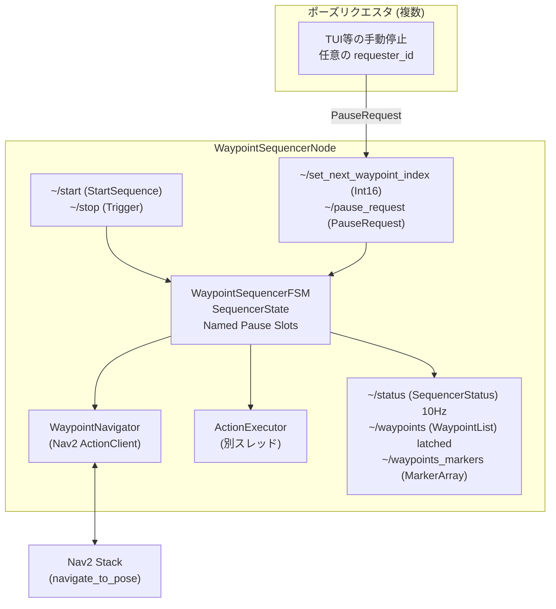
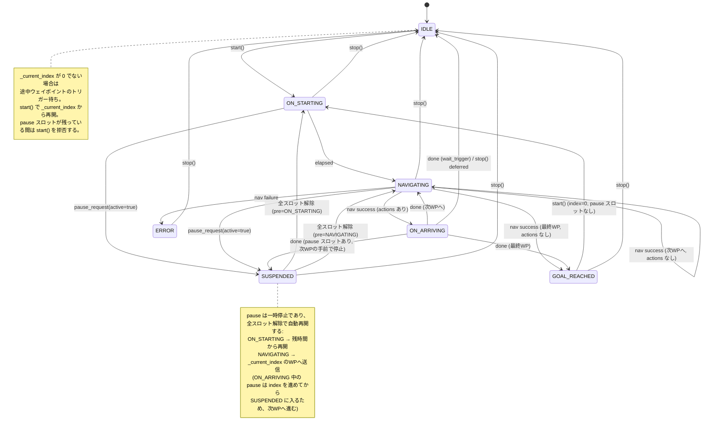

# mg_waypoint_navigation アーキテクチャ

## 概要

`mg_waypoint_navigation` は MG-01 の自律走行における経路追従を担うパッケージ。
従来の `waypoints_follower.py` (mg_navigation) を FSM ベースで完全再設計した。

---

## パッケージ構成

```
mg_waypoint_navigation/
  mg_waypoint_navigation/          # Python ライブラリ
    waypoint.py                    # データモデル v2.0
    waypoint_v1_compat.py          # v1→v2 変換ロジック
    waypoint_sequencer/
      states.py                    # SequencerState enum
      fsm.py                       # WaypointSequencerFSM
      navigator.py                 # WaypointNavigator (Nav2 ラッパー)
      action_executor.py           # ActionExecutor (別スレッド実行)
      actions/
        base.py                    # BaseAction
        generic.py                 # GenericServiceAction / GenericPublishAction
        builtins.py                # LoadMapAction / AmclResetAction / WaitAction / WaitTriggerAction / SetNavigationModeAction
  scripts/
    waypoint_sequencer_node.py     # メインノード
    waypoint_editor_node.py        # ウェイポイント編集ノード
    migrate_waypoints.py           # v1→v2 変換ツール
  launch/
    waypoint_sequencer.launch.py
    waypoint_editor.launch.py
  behavior_trees/
    mg_navigate_to_pose.xml             # 通常時。FollowPath/ComputePathToPose失敗時にWait/BackUp/ClearCostmap等のリカバリーを行う
    mg_navigate_to_pose_queue_wait.xml  # queue_waitモード。回避動作なしでWaitのみ（列に詰める動作用）
  rviz/
    waypoint_editor.rviz
  doc/
    architecture.md
    waypoint_format.md
```

---

## コンポーネント図



`PauseRequest`はTUIの手動停止など明示的な一時停止要求のための汎用機構であり、衝突対応はこの経路を使わない（下記「衝突対応」参照）。

---

## 衝突対応

衝突検知から回避までの一連の振る舞いは、`WaypointSequencerFSM`やPauseRequestを経由せず、**Nav2標準機構の組み合わせで`navigate_to_pose`アクション内部に完結する**（旧`mg_navigation/scripts/collision_behavior_node.py`は廃止済み）。

- **急な動的障害物への即時停止**: `mg_navigation`の`collision_monitor`（`nav2_collision_monitor`）が`cmd_vel_nav`→`cmd_vel_collision`に介入し、`PolygonStop`（速度即ゼロ）と`PolygonApproach`（時間投影による連続減速）の2段構えで低遅延に停止する。RPP（`FollowPath`）自身のコストマップベース衝突チェック（`use_collision_detection`）も併用。
- **一定時間待つ**: `controller_server`の`progress_checker`（`movement_time_allowance`）が、ロボットが一定時間進まないことを検知すると`FollowPath`アクションを失敗させる。この値は`controller_server`単一インスタンスの共有設定のため、衝突対応専用ではなく下記`queue_wait`モードのFollowPathにも同じ値が効く点に注意。
- **解消しなければ回避行動**: 上記の失敗をトリガーに、`mg_navigate_to_pose.xml`の`RecoveryNode`/`RoundRobin`リカバリー（`Wait→BackUp→ClearCostmap`等）が発火する。バックアップ動作自体は`behavior_server`が担当し、`collision_monitor`を経由せず`cmd_vel`に直接publishするため、後退中の安全性は`behavior_server`自身のローカルコストマップベースの衝突チェックに委ねられる。
- **列に並ぶ区間（queue_wait）**: `set_navigation_mode`アクションで`navigation_mode`を`queue_wait`に切り替えると、`mg_navigate_to_pose_queue_wait.xml`が使われる。こちらはリトライ無制限・`Wait`のみで回避動作を行わず、列に詰める動作を再現する。

パラメータの詳細は`mg_navigation/params/nav2_params.yaml`のコメントを参照。

---

## FSM 状態遷移図



---

## ROS インターフェース

### WaypointSequencerNode

| 種別    | トピック/サービス名         | 型                               | 説明                                         |
| ------- | --------------------------- | -------------------------------- | -------------------------------------------- |
| Service | `~/start`                   | `mg_msgs/StartSequence`          | IDLE/GOAL_REACHED → ON_STARTING (pause 中は拒否) |
| Service | `~/stop`                    | `std_srvs/Trigger`               | 任意状態 → IDLE (pause スロットも全解除)     |
| Service | `~/reload_waypoints`        | `std_srvs/Trigger`               | IDLE/GOAL_REACHED/ERROR 時のみ有効           |
| Sub     | `~/set_next_waypoint_index` | `std_msgs/Int16`                 | IDLE/SUSPENDED 時のみ有効                    |
| Sub     | `~/pause_request`           | `mg_msgs/PauseRequest`           | Named Pause Slot 制御 (複数ノードから送信可) |
| Pub     | `~/status`                  | `mg_msgs/SequencerStatus`        | 10Hz, パラメータで無効化可                   |
| Pub     | `~/waypoints`               | `mg_msgs/WaypointList`           | transient_local latched                      |
| Pub     | `~/waypoints_markers`       | `visualization_msgs/MarkerArray` | RViz 表示                                    |

### ノードパラメータ

| パラメータ                | 型     | デフォルト | 説明                             |
| ------------------------- | ------ | ---------- | -------------------------------- |
| `load_path`               | string | `""`       | ウェイポイント YAML パス         |
| `publish_waypoint_status` | bool   | `true`     | ステータスパブリッシュ有効/無効  |
| `waypoint_status_freq_hz` | double | `10.0`     | ステータスパブリッシュ周波数     |
| `publish_waypoints_list`  | bool   | `true`     | ウェイポイントリストパブリッシュ |
| `bt_xml_normal`           | string | パッケージ内 `mg_navigate_to_pose.xml` | 通常モードの BT |
| `bt_xml_queue_wait`       | string | パッケージ内 `mg_navigate_to_pose_queue_wait.xml` | queue_wait モードの BT |
| `goal_checker_set_parameters_service` | string | `/controller_server/set_parameters` | reach_tolerance を反映する先 |
| `goal_checker_xy_tolerance_param` | string | `general_goal_checker.xy_goal_tolerance` | reach_tolerance を書き込むパラメータ名 |

### 到達判定

- **停止点** (`is_through_point: false`): Nav2 の goal_checker で判定する。ゴール送信前に、`reach_tolerance` を `xy_goal_tolerance` として動的に設定する（サービスが無い・失敗した場合は警告を出し、現在値のまま送信する）。
- **通過点** (`is_through_point: true`): Nav2 のフィードバックで残距離と直線距離がどちらも `through_tolerance` 以下になった時点でゴールをキャンセルし、到達とみなして次へ進む。`reach_tolerance` も goal_checker に設定されるので、それ以前に Nav2 が成功を返した場合も到達になる。

### スレッドモデル

- ノードは `MultiThreadedExecutor` で spin する。Nav2 アクションクライアントとアクション用のサービスクライアントは `ReentrantCallbackGroup` に属する。
- on_reached_actions は `ActionExecutor` の別スレッドで実行する。サービス応答は spin せず `threading.Event` で待つ（ノードは既に executor で spin されているため）。
- `WaypointNavigator` はゴールごとに世代 ID を振り、キャンセル後や次ゴール送信後に届いた古い応答・結果を無視する。受理前にキャンセルされたゴールは、受理された直後にキャンセルする。

---

## Named Pause Slot 機構

複数のノードが独立して一時停止を要求できる仕組み。

- `pause_slots: Set[str]` — `requester_id` の集合
- スロットが1つでも存在すると SUSPENDED 状態を維持
- 全スロットが解放された時、`_pre_suspend_state` に応じて中断箇所から自動再開
- IDLE / GOAL_REACHED / ERROR 中の pause は状態を変えず、スロットだけ登録する（`start()` は拒否される）
- `stop()` は全スロットを解除する

---

## ON_ARRIVING 中の deferred 処理

アクション実行中に stop/pause が届いた場合:

- stop: `_stop_pending = True` → アクション完了後に IDLE へ
- pause: アクション完了時点で pause スロットが残っていれば、index を次へ進めてから SUSPENDED へ（途中で解除されていれば、そのまま次WPへ進む）。最終WPなら GOAL_REACHED、wait_trigger 付きなら IDLE を優先する
- stop が優先 (両方届いた場合は stop)
- 実行中のアクション自体は中断できない（`wait` やサービス待ちが終わるまで待つ）
